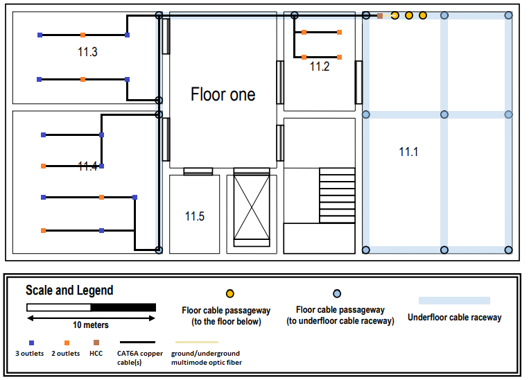

RCOMP 2020-2021 Project - Sprint 1 - Member 1181585 folder 
 ===========================================

## Medidas (em metros) ##
+ **10.1** - 11m x 7m = 77m^2
+ **10.2** - 12,3m x 11m = 135,3m^2
+ **11.2** - 5,6m x 8m = 44,8m^2
+ **11.3** - 11m x 7,25m = 80 m^2
+ **11.4** - 11m x 11,25m = 124m^2

Com estas áreas, o número de outlets em cada divisão será:
+ **10.1** - 14 outlets
+ **10.2** - 26 outlets
+ **10.3** - 5 outlets (na mesa)
+ **11.2** - 8 outlets
+ **11.3** - 16 outlets
+ **11.4** - 24 outlets

## Outras decisões e notas ##
+ Como a maior distância que é possível percorrer em todo o edifício - de um canto inferior do piso 0 até ao canto superior do lado oposto no piso 1 - é aproximadamente 45m, decidi:
    + não utilizar Consolidation Points entre os HCC e os outlets.
    + que apenas serão usados cabos de cobre CAT6A para as ligações de equipamentos no interior do edifício, ao invés de fibra ótica, pois as distâncias entre os equipamentos são todas muito curtas. Esta decisão apenas afeta a ligação entre o MCC e o ICC, pois não iam ser usados CP's.
    + colocar o AP no ponto mais central do teto do piso 0. Como ele tem um alcance de aproximadamente 30 metros em raio, será sempre possível ter acesso Wi-Fi de qualquer ponto do edifício, mas o posicionamento no teto serve para que não haja diferenças significativas entre a qualidade de acesso entre os dois pisos. Também referir que o cabo de fibra ótica que vai alimentar o AP viajará pelo canal subterrâneo da divisão 10.3; este caminho é mais longo do que seria possível, mas assim evita-se que seja necessário fazer obras no edifício que ficam mais caras que a quantidade de cabo que se vai usar.
+ Decidi que não vou distribuir os outlets todos individualmente, pois isso levaria a uma grande quantidade de calhas a transportar os cabos. No entanto, devido a os conectores de cobre terem um comprimento-limite de 5 metros, é necessário que não estejam demasiado acumulados num só sítio da divisão. Concluí que a maior aglomeração de outlets que vou fazer é de 3 outlets.
+ Nas representações de cabos de cobre, as linhas na verdade representam vários cabos - todos os que têm de passar por essa linha para chegar ao outlet - mas todos os cabos vão ser incluídos no cálculo do inventário.
+ No diagrama, onde está representado um cabo de fibra ótica, na realidade estarão dois pois um estará ligado ao ICC do edifício 2 e o outro ao ICC do edifício 3.
+ O MCC vai ter apenas 3 ligações: uma ao ICC do presente edifício, outra ao ICC do edifício 2 e outra ao ICC do edifício 3. Isto permitirá que haja redundância, pois haverá uma forma circular no sistema.

## Backbone dos edifícios ##
> **Nota**: As coordenadas estão em píxeis da imagem respetiva

### Backbone do Piso 0 do Edifício 1 ###

#### Inventário do piso 0 ####
187px <=> 10m
+ MCC (534,31) - technical ditch (554,9) : 42px x3 (edifícios) x2 (redundância) = 192px fibra
+ MCC (534,31) - ICC (534,41) : 10px x2 (redundância) = 20px fibra
+ ICC (534,31) - HCC (534,51) : 10px x2 (redundância) = 20px fibra
+ HCC (534,51) - (554,30) : 29px (x45 outlets + 1 AP) = 1305px cobre + 29px fibra
    + (554,30) - (740,62) : 218px (x12 outlets) = 2616px cobre
        + (740,62) - (666,62) : 74px (x4 outlets) = 296px cobre
        + (740,62) - (594,62) : 146px (x2 outlet) = 292px cobre
        + (740,62) - (740,95) : 33px (x8 outlets) = 264px cobre
            + (740,95) - (714,95) : 26px (x4 outlets) = 104px cobre
                + (740,95) - (632,95) : 108px (x2 outlets) = 216px cobre
            + (740,95) - (667,120) : 98px (x4 outlets) = 392px cobre
                + (667,120) - (594,120) : 73px (x2 outlets) = 146px cobre
    + (554,30) - (554,186) : 156px (x34 outlets + 1 AP) = 5236px cobre + 156px fibra
        + (554,186) - (554,224) : 38px (x28 outlets) = 1064px cobre
            + (554,224) - (568,201) : 37px (x14 outlets) = 518px cobre
                + (568,201) - (632,201) : 64px (x2 outlets) = 128px cobre
                    + (632,201) - (714,201) : 82px (x1 outlet) = 82px cobre
                + (568,201) - (568,177) : 24px (x8 outlets) = 192px cobre
                    + (568,177) - (594,177) : 26px (x4 outlets) = 104px cobre
                        + (594,177) - (667,177) : 73px (x2 outlets) = 146px cobre
                    + (568,177) - (632,148) : 93px (x4 outlets) = 372px cobre
                        + (632,148) - (714,148) : 82px (x2 outlets) = 164px cobre
            + (554,224) - (552,277) : 55px (x14 outlets) = 770px cobre
                + (552,227) - (586,227) : 34px (x6 outlets) = 204px cobre
                    + (586,227) - (636,227) : 50px (x4 outlets) = 200px cobre
                        + (636,227) - (692,227) : 56px (x2 outlets) = 112px cobre
                + (552,227) - (558,341) : 120px (x8 outlets) = 960px cobre
                    + (558,341) - (608,341) : 50px (x6 outlets) = 300px cobre
                        + (608,341) - (665,341) : 57px (x4 outlets) = 228px cobre
                            + (665,341) - (716,341) : 51px (x2 outlets) = 102px cobre
        + (554,186) - (22,186) : 532px (x5 outlets + 1 AP) = 2660px cobre + 532px fibra
            + (22,186) - (22,204) : 18px (x1 AP) = 18px fibra
                + (22,204) em altura : 75px (x1 AP) = 75px fibra
                    + (22,204) - (373,204) : 351px (x1 AP) = 351px fibra
            + (22,186) - (95,182) : 77px (x5 outlets) = 385px cobre
                + (95,182) - (95,174) : 8px (x5 outlets) = 40px cobre
                + (95,182) - (95,129) : 53px (x4 outlets) = 212px cobre
                + (95,182) - (95,78) : 104px (x2 outlets) = 208px cobre
Calha:
1450px

#### Total ####
+ Fibra: 1285px = 69 metros
+ Cobre: 20018 = 1077 metros
+ Calha: 78m
+ Outlets
    + 22 tomadas de 2 outlets
    + 1 tomada de 1 outlet
+ 1 bastidor
    + MCC
        + 1 Patch Panel Fibra Ótica de 8 portas
    + ICC
        + 1 Patch Panel Fibra Ótica de 8 portas
    + HCC
        + 1 Patch Panel CAT6A de 48 portas
+ 1 AP (Router)
+ Patch Cord: 22,5 metros

### Backbone do Piso 1 do Edifício 1 ###

#### Inventário do piso 1 ####
+ ICC (R/C 534,31) - HCC (547,22) : 8m x2 (redundância) = 16m fibra
184px <=> 10m
+ (547,22) - (424,22) : 123px (x48 outlets) = 5904px cobre
    + (424,22) - (424,46) : 24px (x8 outlets) = 192px cobre
        + (424,46) - (438,46) : 14px (x4 outlets) = 56px cobre
            + (438,46) - (489,36) : 61px (x2 outlets) = 122px cobre
        + (424,46) - (438,82) : 50px (x4 outlets) = 200px cobre
            + (438,82) - (489,82) : 51px (x2 outlets) = 102px cobre
    + (424,22) - (229,22) : 195px (x40 outlets) = 7800px cobre
        + (229,22) - (183,50) : 74px (x8 outlets) = 592px cobre
            + (183,50) - (119,50) : 74px (x5 outlets) = 370px cobre
                + (119,50) - (57,50) : 62px (x3 outlets) = 186px cobre
        + (229,22) - (229,144) : 122px (x32 outlets) = 3904px cobre
            + (229,144) - (183,114) : 46px (x8 outlets) = 368px cobre
                + (183,114) - (119,114) : 64px (x5 outlets) = 320px cobre
                    + (119,114) - (57,114) : 62px (x3 outlets) = 186px cobre
            + (229,144) - (229,165) : 21px (x24 outlets) = 504px cobre
                + (229,165) - (146,193) : 111px (x11 outlets) = 1221px cobre
                    + (146,193) - (62,193) : 84px (x3 outlets) = 252px cobre
                    + (146,193) - (146,239) : 46px (x5 outlets) = 230px cobre
                        + (146,239) - (62,239) : 84px (x2 outlets) = 168px cobre
                + (229,165) - (229,360) : 195px (x14 outlets) = 2730px cobre
                    + (229,360) - (193,332) : 64px (x14 outlets) = 896px cobre
                        + (193,332) - (193,284) : 48px (x8 outlets) = 384px cobre
                            + (193,284) - (146,284) : 47px (x5 outlets) = 235px cobre
                                + (146,284) - (62,284) : 84px (x3 outlets) = 252px cobre
                        + (193,332) - (146,332) : 47px (x5 outlets) = 235px cobre
                            + (146,332) - (62,332) : 84px (x2 outlets) = 168px cobre
Calha:
1300px

#### Total ####
+ Fibra: 16 metros
+ Cobre: 27577px <=> 1500 metros
+ Calha: 71m
+ Outlets
    + 9 tomadas de 2 outlets
    + 10 tomadas de 3 outlets
+ 1 bastidor
    + HCC
        + 1 Patch Panel CAT6A com 48 portas
        + 1 Patch Panel Fibra Ótica com 8 portas
+ Patch Cord: 24 metros

