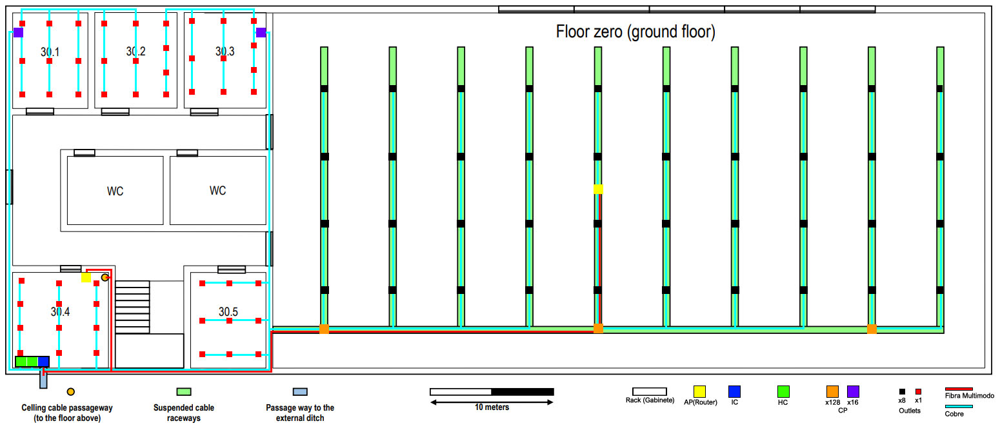
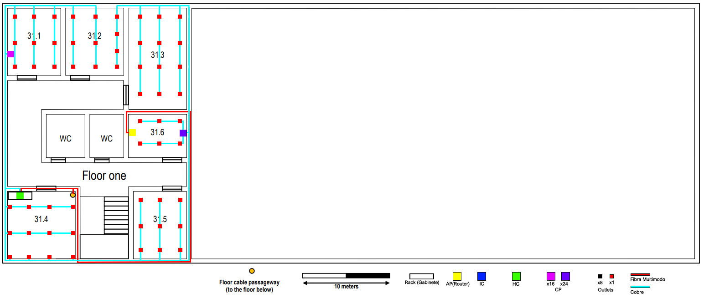

RCOMP 2019-2020 Project - Sprint 1 - Member 1170617 folder
===========================================

## Edifício 3

Para este projeto, fiquei encarregue de cobrir o Edifício C com cobertura de Wi-fi.

### Piso 0

Este piso contém:

- 1 Intermediate cross-connect (IC)
- 2 Horizontal cross-connect (HC)
- 5 Consolidation Point (CP)
  - 2 Switch com 16 portas
  - 2 Patch Panel com 16 portas - CAT6A
  - 3 Switch com 128 portas
  - 3 Patch Panel com 128 portas - CAT6A
- 2 Access Point (Ac) ou Routers
- 377 Outlets
- 377 Patch coords
- 74 metros de Fibra Multimodo.
- 6611 metros de Cobre CAT6A.
- 319.5 metros de calha.
- 2 Bastidores

Nota: O total de Fio de Cobre já têm em conta a redundância, tendo assim 2 cabos de fibra a ligar de um IC a um HC.

### Piso 1

Este piso contém:

- 1 Horizontal cross-connect (HC)
  - 1 Switch 24 Portas
  - 1 Patch Panel 24 Portas - Fibra
- 2 Consolidation Point (CP)
  - 1 Switch com 16 portas
  - 1 Patch Panel com 16 portas - CAT6A
  - 1 Switch com 24 portas
  - 1 Patch Panel com 24 portas - CAT6A
- 1 Access Point (Ac) ou Routers
- 62 Outlets
- 62 Patch coords
- 76,4 metros de Fibra Multimodo.
- 1143 metros de Cobre CAT6A.

Nota: O total de Fio de Cobre já têm em conta a redundância, tendo assim 2 cabos de fibra a ligar de um IC a um HC.

### Medidas

#### As medidas de cada sala de ambos os pisos são:

| Sala   | Ci (cm) | Li (cm) | Cr (m) | Lr (m) | A (m²) | Outlets |
|--------|---------|---------|--------|--------|--------|---------|
| 30.1   | 2,7     | 2,1     | 7,71   | 6,00   | 46     | 9       |
| 30.2   | 2,7     | 2,3     | 7,71   | 6,57   | 51     | 10      |
| 30.3   | 2,7     | 2,3     | 7,71   | 6,57   | 51     | 10      |
| 30.4   | 2,7     | 2,7     | 7,71   | 7,71   | 60     | 12      |
| 30.5   | 2,7     | 2,1     | 7,71   | 6,00   | 46     | 9       |
| Salão  | 20      | 10      | 57,14  | 28,57  | 1633   | 327     |
| Total  |         |         |        |        |        | 377     |
| 31.1   | 2,7     | 2,1     | 7,71   | 6,00   | 46     | 9       |
| 31.2   | 2,7     | 2,3     | 7,71   | 6,57   | 51     | 10      |
| 31.3   | 4       | 2,3     | 11,43  | 6,57   | 75     | 15      |
| 31.4   | 2,7     | 2,7     | 7,71   | 7,71   | 60     | 12      |
| 31.5   | 2,7     | 2,1     | 7,71   | 6,00   | 46     | 9       |
| 31.6   | 1,7     | 2,3     | 4,86   | 6,57   | 32     | 6       |
| Total  |         |         |        |        |        | 62      |

Escala: 3,5cm ⇔ 10m

Real = [(imagem) * 10] / 3,5

Outlets = (Área / 10) * 2

#### As medidas dos cabos do piso 0 são:

Fibra:

- 27,7 cm (APs)

Cobre:

- 196,2 (Salas) + 2104 (Salão) + 79,8 (Ligações IC-HC // HC-CP) = 2380 cm

Escala: 3,6cm ⇔ 10m

Total:

- 74 metros de Fibra
- 6611 metros de Cobre

#### As medidas dos cabos do piso 1 são:

Fibra:

- 54 (AP) + 22,4 (Ligação IC do Piso 0 - HC do Piso 1) = 76,4 m

Cobre:

- 389,1 (Salas) + 22,5 (Ligações HC-CP) = 411,6

Escala: 3,6cm ⇔ 10m

Total:

- 76,4 metros de Fibra
- 1143 metros de Cobre
