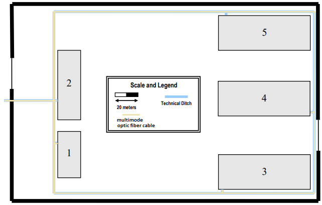

### Backbone do Campus ###

#### Inventário do Campus ####
+ entrada do campus: 98px
+ entrada do campus até à entrada do edifício 1: 86px
+ entrada em cada edifício: 7px; total: 91px
    + edifício 1: x7 = 49px
    + edifício 2, 3, 4: x2x3 = 42px
+ volta ao campus: 1758px (x3 ligações x2 com redundância) = 10548px
    + passagens a este e oeste: 360px (x2)
    + passagens a norte e sul: 519px (x2)

43px = 20m
Total: 10823px <=> 5034m