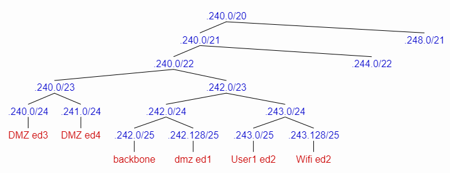
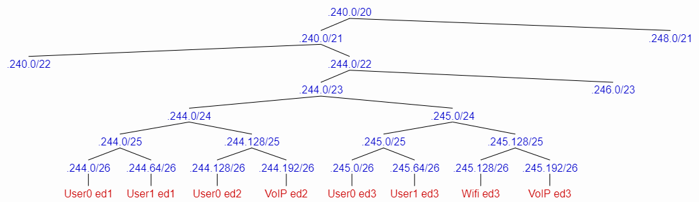
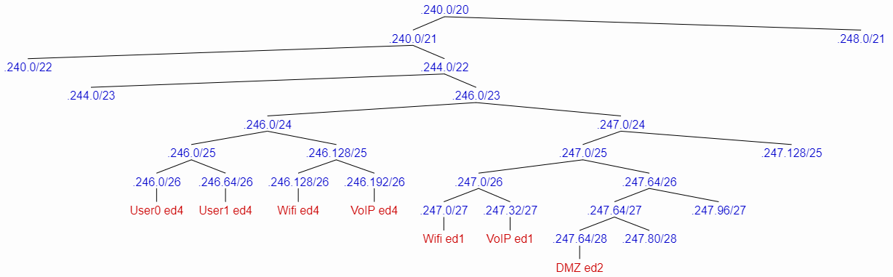

RCOMP 2020-2021 Project - Sprint 2 planning
===========================================
### Sprint master: 1170878 ###
# 1. Sprint's backlog #

- Development of a layer two and layer three Packet Tracer simulation for building 1, and also encompassing the campus backbone. Integration of every members� Packet Tracer simulations into a single simulation. -1181585
- Development of a layer two and layer three Packet Tracer simulation for building 2, and also encompassing the campus backbone.-1170727
- Development of a layer two and layer three Packet Tracer simulation for building 3, and also encompassing the campus backbone.-1170617
- Development of a layer two and layer three Packet Tracer simulation for building 4, and also encompassing the campus backbone.-1170878
- Fixe issues from last sprint


# 2. Technical decisions and coordination #
In this section, all technical decisions taken in the planning meeting should be mentioned. 		Most importantly, all technical decisions impacting on the subtasks implementation must be settled on this 		meeting and specified here.

  * Backbone cable types to be used

		Copper cables (CAT6A) between the CP's and between CP's and HC's. Multimode Optic Fiber cables between HC's and IC's and between the IC's and the MC and between HC's and AP's.  

  * VLAN IDs to be used

		Default VLAN is the VLAN with ID 1.

		The range of VLAN IDs go from 365 to 395.

		The team as dicide to use the following templete for the VLAN names
					
								        	X_Y
		X Building
		Y VLAN name 

  * VTP domains

		 rcompdng1
	
  * IPv4 networks' addresses and routers' addresses

		IPV4 adresses strats at 10.126.240.0/20 
	
		ISP router IPv4 node address  is 120.57.201.241/30

* Devices naming

		The team as dicide to use the following templete for the devices names 
		 		
										X_Y_FloorZ_W  
	X Building 
	Y Devices 
	Z Floor
	W Number of the Device


  * Routing protocols

  * Application protocols outlining (further coordination may be required between members)

# 3. Subtasks assignment #
(For each team member (sprint master included), the description of the assigned subtask in sprint 2)

#### Example: ####

#### The Vlans were distributed in the following manner:####

  * 1181585 - Building 1. Vlan[365-369], Campus Vlan[385];
  * 1170727 - Building 2. Vlan[370-374];
  * 1170617 - Building 3. Vlan[375-379];
  * 1170878 - Building 4. Vlan[380-384];
#### The IPV4 block adresses were distibuted in the following manner: ####


1181585 - Building 1

	Backbone - 10.126.242.0/25
	Router address - 10.126.242.1/25
	1_User0 - 10.126.244.0/26
	1_User1 - 10.126.244.64/26
	1_Wifi - 10.126.247.0/27
	1_DMZ - 10.126.242.128/25
	1_VoIP - 10.126.247.32/27

1170727 - Building 2

	Router addresed - 10.126.242.2/25
	2_User0 - 10.126.244.128/26
	2_User1 - 10.126.243.0/25
	2_Wifi - 10.126.243.128/25
	2_DMZ - 10.126.247.64/28
	2_VoIP - 10.126.244.192/26

1170617 - Building 3

 	Router addres - 10.126.242.3/25
	3_User0 - 10.126.245.0/26
	3_User1 - 10.126.245.64/26
	3_Wifi - 10.126.245.128/26
	3_DMZ - 10.126.240.0/24
	3_VoIP - 10.126.245.192/26

1170878 - Building 4

	Router adress - 10.126.242.4/25
	4_User0 - 10.126.246.0/26
	4_User1 - 10.126.246.64/26
	4_Wifi - 10.126.246.128/26	
	4_DMZ - 10.126.241.0/24
	4_VoIP - 10.126.246.192/26
	
	
Left out addresses

	10.126.248.0/21
	10.126.247.128/25
	10.126.247.96/27
	10.126.247.80/28

Address blocks routed (next-hop) to building 2 (10.126.242.2/25):

- 10.126.243.0/24
- 10.126.244.128/25
- 10.126.247.64/28

Address blocks routed (next-hop) to building 3 (10.126.242.3/25):

- 10.126.240.0/24
- 10.126.245.0/24

Address blocks routed (next-hop) to building 4 (10.126.242.4/25):

- 10.126.241.0/24
- 10.126.246.0/24

The address blocks from building 1 don't need to be added to the routing table since they're local to the router's sub-interfaces.


#####This is how we get the previous results: #####

































