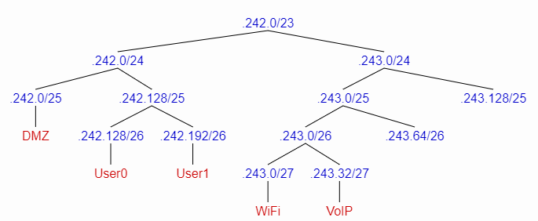

RCOMP 2020-2021 Project - Sprint 3 - Member 1181585 folder
===========================================

## Correções do Sprint 2
Foi necessário mudar os endereços IPv4, por isso a nova configuração para cada rede do edifício 1 vai ser:

| Bloco | n-nós | Endereço | VLAN |
|:-|-|-|-|
| Backbone | 120 | 10.126.240.0/25 | 385 |
| Edifício 1 |  | 10.126.242.0/23|
| User0 | 40 | 10.126.242.128/26 | 365 |
| User1 | 40 | 10.126.242.192/26 | 366 |
| Wifi | 24 | 10.126.243.0/27 | 367 |
| DMZ | 70 | 10.126.242.0/25 | 368 |
| VoIP | 20 | 10.126.243.32/27 | 369 |

Sobram os blocos de endereços:

    10.126.243.64/26 (256 nós)
    10.126.243.128/25 (512 nós)

